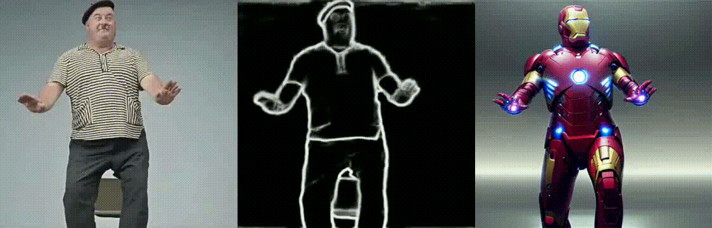
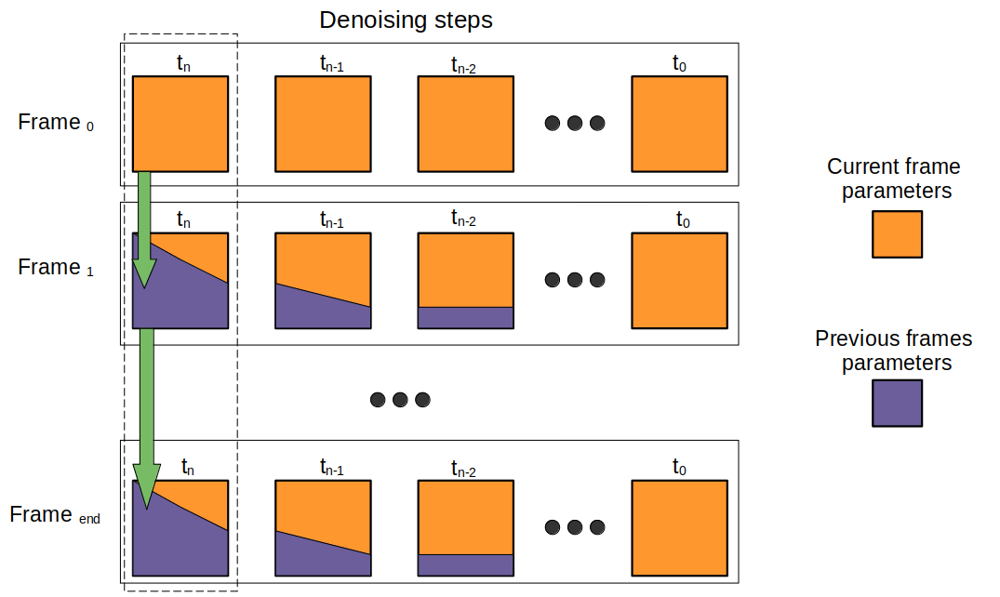

# Interpolate Attention For Video To Video Animation

Current approach allows you use controlnet diffusion models for video to video processing.
It does't require any training or something. All models can be used from scratch as is.
This repo uses Controlnet pipeline from <a href="https://github.com/huggingface/diffusers">diffusers</a>.
Also you can feel free use any Unet models from other finetuned models. For creation this gif images I have used <a href="https://civitai.com/models/4823/deliberate">deliberate</a>.

<!--  -->


It takes ~7 GPU MEM with default model and ~8.5GB GPU MEM with addition unet.

### Comparison with nad without attention interpolation

<!--  -->


# Getting Started

## Install requirements

```bash
git clone https://github.com/TheDenk/Attention-Interpolation.git
cd Attention-Interpolation

pip install -r requirements.txt
```

## Simple run

run.py script uses config file in configs folder. By default it is default.yaml.
Script contains all parameters for generation, such as prompt, seed etc.

```bash
python run.py
```
or overwrite config prompt
```bash
python run.py --prompt="Iron man in helmet, high quality, 4k"
```
or with config
```bash
python run.py --config=./configs/default.yaml
```
or with selected gpu
```bash
CUDA_VISIBLE_DEVICES=0 python run.py --config=./configs/default.yaml
```
or with video path and prompts
```bash
python run.py --prompt="Iron man in helmet, high quality, 4k"  \
    --input_video_path="./video/input/man.mp4" \
    --output_video_path="./video/output/default.mp4"
```
### Using different Controlnet Models
Any Controlnet model can be used for image generation.
<!--  -->


# Method Description
Attention Interpolation can be used for different layers in Attention mechanism.
For example: Query, Key, Value, Attention Map, Output Linear Layer.
In practice Interpolation for Attention Map and Output Linear Layer gives the best result.



## Parameters Description
```yaml
  interpolation_scheduler: ema  # <-- rule for changing the ema parameter
  ema: 0.625  # <-- interpolation point between the previous frames and the current frame
  eta: 0.875  # <-- for ema scheduler each denoising step ema changes: ema=ema*eta (inapplicable to cos and linear)
  ...
  use_interpolation:  # <-- layers for which interpolation is applied
  ...
  attention_res: 32  # <-- maximum attention map resolution for which interpolation is applied
  allow_names:  # <-- part of Unet for which interpolation is applied
  ...
```

## Contacts
<p>Issues should be raised directly in the repository. For professional support and recommendations please <a>welcomedenk@gmail.com</a>.</p>
